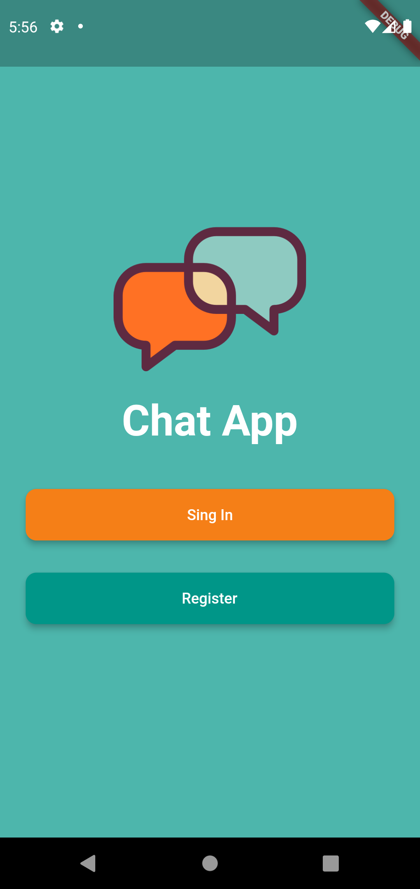
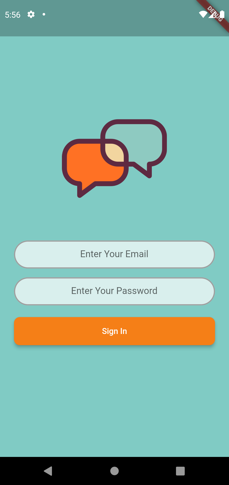
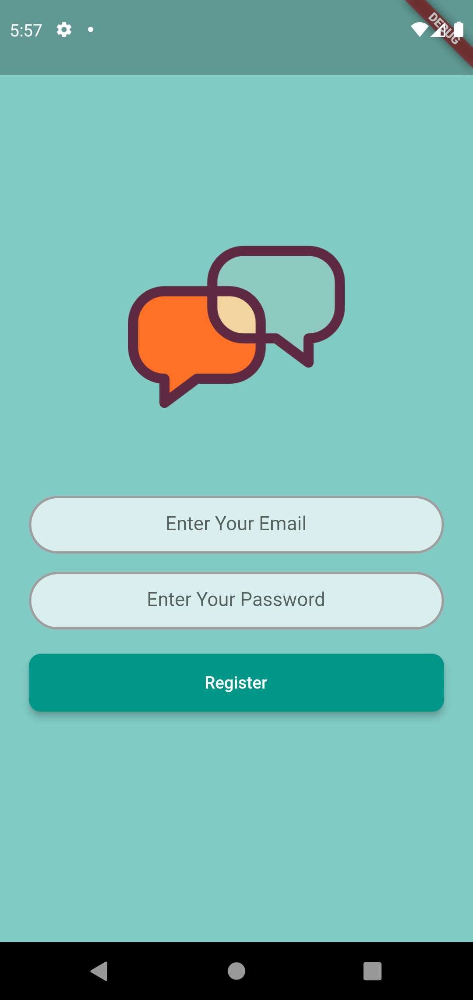
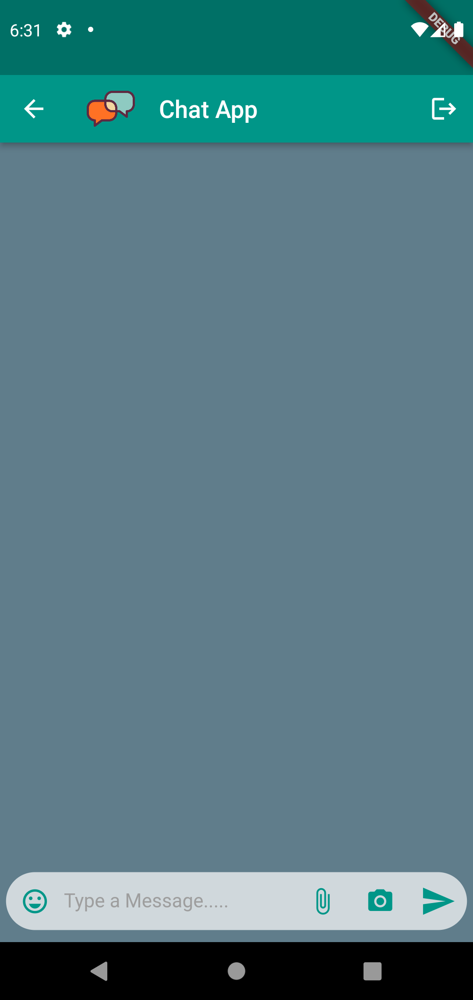
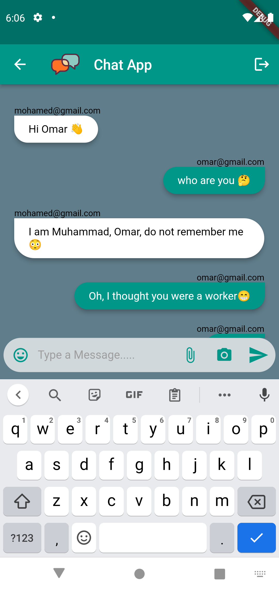

### Note_Pade Project
----

  

> It is a mobile app that works on Android and iPhone. The idea of the application is a remote conversation between two or more people, and it works with Firebase technology .

## Description

> It is a mobile app that works on Android and iPhone, built in flutter and Dart programming languages and with Firebase technology. The transmission process is between you and the other party, and you can exit and enter a new account by logging out. Thank you. Please enjoy .

## Development

* [x] **Flutter** 
* [x] **Dart**
* [x] **Firebase**

## ScreenShots

